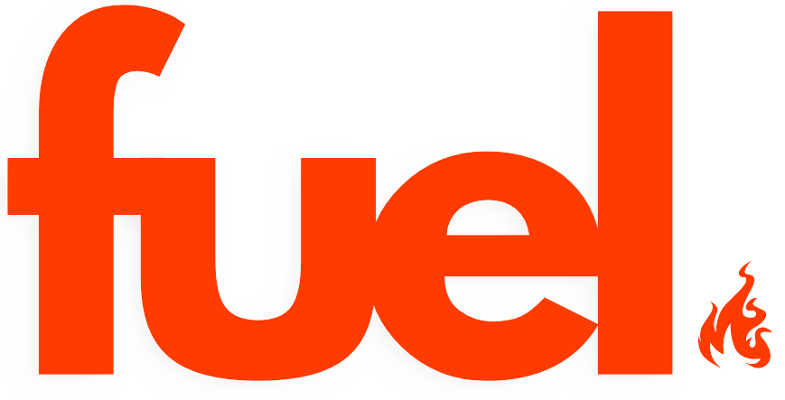

Welcome to Fuel, a web application designed to simplify dining decisions among friends or couples. Fuel helps users find the perfect restaurant by aligning their preferences with those of their friends, making dining out a more enjoyable and harmonious experience.

## 🍴 Table of Contents

- [Demo](#demo)
- [Features](#features)
- [Technologies](#technologies)
- [Getting Started](#getting-started)
- [Usage](#usage)
- [Contributing](#contributing)
- [License](#license)

## 🔥 Demo <a name="demo"></a>

Check out the live demo [here](https://fuel-app.netlify.app)

## 🌟 Features <a name="features"></a>

- **Connect with Friends**: Users can create accounts and connect with friends to share restaurant preferences and make dining decisions together.
- **Swipe through Restaurant Options**: Navigate through a curated list of restaurant options by clicking to indicate preferences.
- **Match Notifications**: Receive instant notifications when both users like the same restaurant, making it easy to find mutual favorites.
- **Favorites and Visited**: Keep track of favorite restaurants and mark places already visited for future reference.

## 🌐 Technologies used

- **Frontend**: HTML, CSS, JavaScript
- **Backend**: Node.js, Express.js
- **Database**: MongoDB
- **API Integration**: Yelp
- **Deployment**: Netlify

## 🚀 Getting Started <a name="getting-started"></a>

**Prerequisites:**

- Ensure that you have Node.js installed on your machine. You can download it [here](https://nodejs.org/).

**Step-by-Step Guide:**

**Front-end setup**

1. **Clone the Repository:**

   - Open your terminal or command prompt.
   - Run the following command to clone the repository:

     ```bash
     git clone https://github.com/brendaesilveira/fuel-frontend.git
     ```

2. **Navigate to the Project Directory:**

   - Change into the project directory:

     ```bash
     cd fuel-frontend
     ```
     
3. **Install Dependencies:**

   - Install the project dependencies using the following command:

     ```bash
     npm install
     ```

4. **Run the Application:**

   - Start the development server with the following command:

     ```bash
     npm run dev
     ```
     
5. **Clone the Back-end Repository:**

     - Open another terminal or command prompt.
   - Run the following command to clone the repository:

     ```bash
     git clone https://github.com/brendaesilveira/fuel-backend.git
     ```
     
6. **Navigate to the Project Directory:**

 - Change into the project directory:

     ```bash
     cd fuel-backend
     ```
     
4. **Run the Application:**

   - Start the development server with the following command:

     ```bash
     npm run dev
     ```

## 👩‍💻 Usage <a name="usage"></a>

- **Sign up for an account on the Fuel website**: Upon registration, you'll receive a unique friend code.
- **Connecting with Friends**: Share your friend code with friends or invite them to join Fuel. Once your friend connects using your code, you'll be linked on the platform.
- **Exploring Restaurants**: Navigate through the list of restaurant options by clicking on the heart button. Each click adds a restaurant to your liked list.
- **Finding Matches**: If both you and your connected friend like the same restaurant, you'll get a match notification. Enjoy exploring mutual favorites and planning your dining outings together!
- **Managing Favorites and Visited**: Add restaurants to your favorites list for quick access to your preferred spots. Mark places you've already visited to keep track of your dining adventures.
- **Exploring Matches**: Check your matches to see which restaurants you and your friends have in common. Plan your next dining experience based on your shared interests!


## 🤝 Contributing <a name="contributing"></a>

Contributions are welcome! If you have ideas for improvements or new features, please open an issue or submit a pull request.

## 📄 License <a name="license"></a>

This project is licensed under the MIT License, which means you are free to use, modify, and distribute the code.
